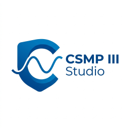
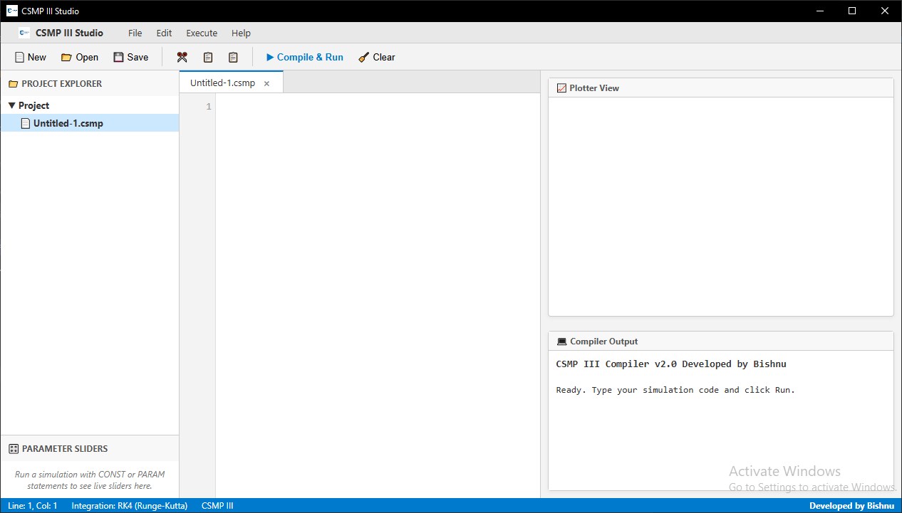
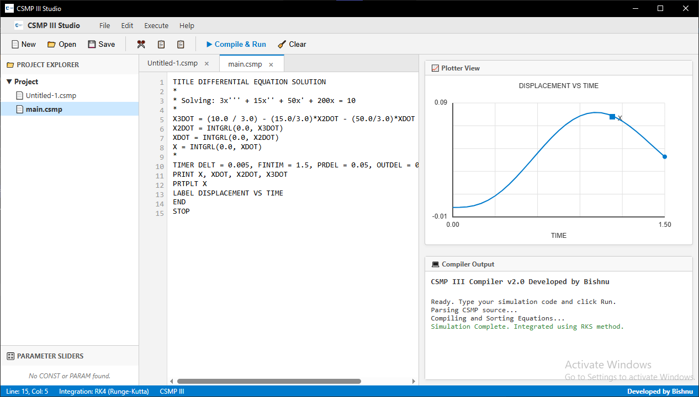

<div align="center">
  
  <h1>CSMP III Studio</h1>
  <p><strong>A modern, native Windows IDE and Compiler for the classic CSMP III Continuous System Modeling Program.</strong></p>
  
  [](https://opensource.org/licenses/MIT)
  []()
  [](https://electronjs.org/)
</div>

<br>

<div align="center">
  <h3>
    <a href="#downloads">⬇️ Download Latest Release</a>
    <span> | </span>
    <a href="#features">✨ Features</a>
    <span> | </span>
    <a href="#getting-started">🚀 Getting Started</a>
  </h3>
</div>

---

## 🎯 What is CSMP III Studio?
CSMP III Studio completely reimagines the classic Continuous System Modeling Program (CSMP) simulation tool for the modern era. Developed to support engineering lab practicals and advanced system modeling, this Studio replaces the archaic terminal-based workflows with a fully native, responsive IDE featuring real-time graphical plotting.

## 📸 Screenshots

*(Add your screenshots here!)*
> 
> *The modern IDE featuring real-time syntax error checking and parameter sliders.*

> 
> *The built-in oscilloscope rendering multi-variable integration in real time.*

---

## <a name="downloads"></a> ⬇️ Download & Installation

The easiest way to use CSMP III Studio is to download the compiled Windows installer.

1. Head to the [Releases Page](../../releases) on this repository.
2. Download the latest `CSMP III Studio Setup.exe` file.
3. Run the installer. 
   > **Note:** Because this is an indie open-source tool, Windows Defender or SmartScreen might flag it as "Unrecognized". Simply click **"More Info" -> "Run Anyway"**.

---

## ✨ Features

- **Modern Native IDE:** A VS Code-like interface tailored entirely for CSMP scripts.
- **Strict Syntax Compiler:** Instant error throwing, highlighting, and parsing of CSMP syntax (RK4 integration, Euler, etc.).
- **Real-time Oscilloscope:** A built-in graphical plotter that dynamically charts `PRTPLT` variables with multi-line tracking and tooltip hovering.
- **Dynamic Parameter Sliders:** Interactively tweak `CONST`, `INCON`, and `PARAM` values on the fly without rewriting your code.
- **Help & Examples:** Built-in templates for differential equations and suspension systems to get you started instantly.

---

## 🚀 Getting Started (For Developers)

If you'd like to clone this repository, run the app from source, or contribute:

### Prerequisites
- [Node.js](https://nodejs.org/) (v18 or higher recommended)
- Git

### Installation
1. Clone the repository:
   ```bash
   git clone https://github.com/your-username/csmp-iii-studio.git
   cd csmp-iii-studio
   ```
2. Install dependencies:
   ```bash
   npm install
   ```
3. Run the Studio in development mode:
   ```bash
   npm start
   ```

### Building the Executable
To package the app into a Windows installer yourself:
```bash
npm run make
```
The compiled installer will be generated inside the `dist/` folder.

---

## 🤝 Contributing
Contributions, issues, and feature requests are always welcome! Feel free to check the [issues page](../../issues) if you want to contribute.

## 👨‍💻 Developed By
**Bishnu** 
*(Support the project via the Buy us Momo Donation button inside the app!)*

## 📄 License
This project is [MIT](LICENSE) licensed.
